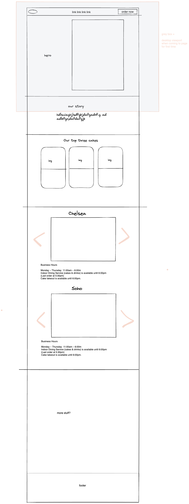

# HARBS

An unofficial landing page for Japanese Cafe, HARBS.

## Getting Started

There are two ways to run this project.

### 1. Online

Simply visit [the live link](#) (TODO)

### 2. Local Setup

1. Clone this repository onto your computer
2. If you don't have it already, install [Node](https://nodejs.org/en)
3. Open your computer's terminal, change directory into the cloned repo's root folder, and and enter each line individually:

```bash
npm i
npm run build
npm run preview
```

4. Then visit the URL provided in the terminal.

## Diagrams & Planning

With how important design is for a landing page, we made a basic sketch of the page's flow before creating any of its pieces.


## About

_Rose:_

> Coming out of bootcamp, I wanted to use my skills to solve real-world problems.
>
> So, I decided to look around me.
>
> As someone who works at HARBS, I found our official website a bit lacking.
> Eager to practice my front end and UX/UI skills, I tasked myself with creating a modern, clean landing page.
>
> I missed the social aspect of pair-programming & also wanted insights on designs. So I invited one of my cohort-mates onto the project.
